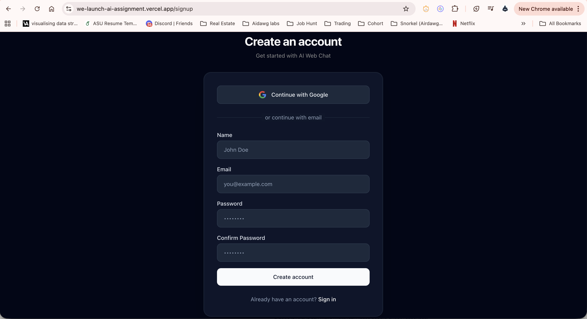
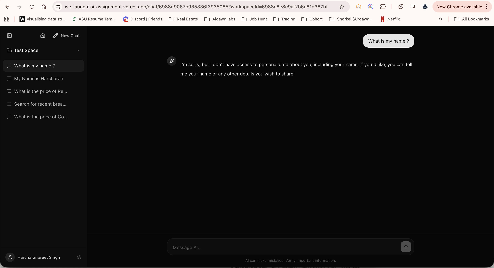

# WeLaunch.AI — AI Web Chat Application

A modern AI‑powered web chat application built with Next.js App Router, MongoDB, OpenRouter, and LangChain/LangGraph. It supports authentication, workspace‑based chat organization, persistent chat history, real‑time streaming responses, and web‑search tool calling.

---

## Table of Contents

1. Overview
2. Features
3. Tech Stack
4. Architecture
5. Data Flow
6. API Reference
7. Environment Variables
8. Setup & Run Locally
9. Build & Deployment
10. Usage Notes
11. Troubleshooting
12. Security Notes

---

## 1. Overview

This project was created for a 48‑hour engineering assignment to build a production‑style AI chat app with:

- User authentication
- Workspace/project separation
- Multiple chats per workspace
- Persistent memory in a database
- Real‑time AI streaming to the UI
- Web‑search tool calling via an agent

The app is deployed and intended to be evaluated on:

- Streaming behavior
- Tool calling and live web data
- Persistence across sessions
- Code structure and clarity

---

## 2. Features

### Authentication
- Google OAuth + Email/Password credentials
- Isolated user data (workspaces, chats, messages)

### Workspaces
- Create, rename, delete workspaces
- Each workspace holds multiple chats
- Workspace selector in the sidebar

### Chat Experience
- Modern chat UI (inspired by contemporary AI products)
- Smooth streaming responses (token‑level)
- Chat titles auto‑update on first message

### Persistent Memory
- Messages stored in MongoDB
- Sessions and history persist across reloads

### Tool Calling + Web Search
- LangGraph agent with web search tool
- Web search results visible in UI
- Queries normalized for recency

---

## Screenshots

Sign In


Sign Up


Home / Workspace Selection


Chat History (Persistent)


Chat History (Alternate)


Web Search Tool Calling


---

## 3. Tech Stack

**Frontend**
- Next.js 16 (App Router)
- React 19
- TypeScript
- Tailwind CSS

**Backend**
- Next.js API routes (Route Handlers)

**Auth**
- NextAuth v5 (via `auth.ts`)

**Database**
- MongoDB (Mongoose)

**AI + Agents**
- OpenRouter (via `@langchain/openai`)
- LangChain + LangGraph
- Exa search API for web search

---

## 4. Architecture

```
┌────────────────────┐
│  Next.js Frontend  │
│  (App Router UI)   │
└─────────┬──────────┘
          │
          ▼
┌──────────────────────────┐
│ Next.js API Routes        │
│ /api/auth /api/chat       │
│ /api/chats /api/workspaces│
└─────────┬─────────────────┘
          │
          ▼
┌──────────────────────────┐
│ MongoDB                   │
│ Users / Workspaces / Chats│
│ Messages                  │
└─────────┬─────────────────┘
          │
          ▼
┌──────────────────────────┐
│ LangGraph Agent + Tools   │
│ OpenRouter + Exa Search   │
└──────────────────────────┘
```

---

## 5. Data Flow

### 5.1 Sign‑in
1. User signs in via Google or Credentials
2. NextAuth issues a JWT session
3. Session is attached to each request

### 5.2 Workspaces
1. UI loads workspaces from `/api/workspaces`
2. User selects or creates a workspace
3. Active workspace sets the chat list

### 5.3 Chats
1. User creates a chat (requires workspace)
2. Chat is saved with `workspaceId`
3. First user message auto‑sets chat title

### 5.4 Messages + Streaming
1. User sends message → `/api/chat`
2. Message stored in DB
3. LangGraph agent streams output
4. UI renders streaming tokens live

### 5.5 Tool Calling
1. Agent calls `web_search`
2. Exa returns structured results
3. UI shows a tool card with results

---

## 6. API Reference

### Authentication
- **GET/POST** `/api/auth/*` — NextAuth routes

### Workspaces
- **GET** `/api/workspaces` — list user workspaces
- **POST** `/api/workspaces` — create workspace
- **PATCH** `/api/workspaces` — rename workspace
  - body: `{ workspaceId, name }`
- **DELETE** `/api/workspaces?workspaceId=...` — delete workspace + chats

### Chats
- **GET** `/api/chats?workspaceId=...` — list chats in workspace
- **POST** `/api/chats` — create chat
  - body: `{ workspaceId, title? }`
- **PATCH** `/api/chats` — rename chat
  - body: `{ chatId, title }`
- **DELETE** `/api/chats?chatId=...` — delete chat + messages

### Messages
- **GET** `/api/messages?chatId=...` — load message history for chat

### AI Chat
- **POST** `/api/chat` — streaming chat endpoint
  - body: `{ chatId, messages }`

---

## 7. Environment Variables

Create a `.env.local` file and add:

```
# Auth
AUTH_SECRET=your_secret_here
AUTH_URL=http://localhost:3000
GOOGLE_CLIENT_ID=your_google_client_id
GOOGLE_CLIENT_SECRET=your_google_client_secret

# Database
MONGODB_URI=mongodb+srv://...

# AI Providers
OPENROUTER_API_KEY=sk-or-...
EXA_API_KEY=exa_...
```

Notes:
- For production, set `AUTH_URL` to your deployed domain.
- `AUTH_SECRET` is required to avoid auth loops.
- Never hard‑code API keys in the repo.

---

## 8. Setup & Run Locally

```bash
npm install
npm run dev
```

Open: `http://localhost:3000`

---

## 9. Build & Deployment

```bash
npm run build
npm run start
```

On Vercel:
1. Add environment variables
2. Deploy
3. Ensure OAuth redirect URI is configured:
   - `https://your-domain.com/api/auth/callback/google`

---

## 10. Usage Notes

- A workspace is required before creating a chat.
- Chat titles auto‑update after the first user message.
- Tool cards expand to show web search results.

---

## 11. Troubleshooting

**Login redirect loop**
- Ensure `AUTH_SECRET` is set in production

**Google OAuth redirect_uri_mismatch**
- Add the correct callback URL in Google Cloud console

**Streaming not visible**
- Ensure `useChat` uses `initialMessages`, not `messages`

**Web search results empty**
- Confirm Exa API key
- Ensure tool returns structured `{ results[] }`

---

## 12. Security Notes

- No secrets are committed to the repo
- All API keys are loaded via environment variables
- JWT session strategy with NextAuth

---

## Assignment Requirements Mapping

✅ Authentication with isolated user data
✅ Workspaces with multiple chats
✅ Persistent memory in MongoDB
✅ Streaming AI responses
✅ LangGraph tool calling + web search
✅ OpenRouter API usage
✅ Deployed link + GitHub repo + docs

---

## License

This project was built for an engineering assignment and is not intended for commercial use without permission.
